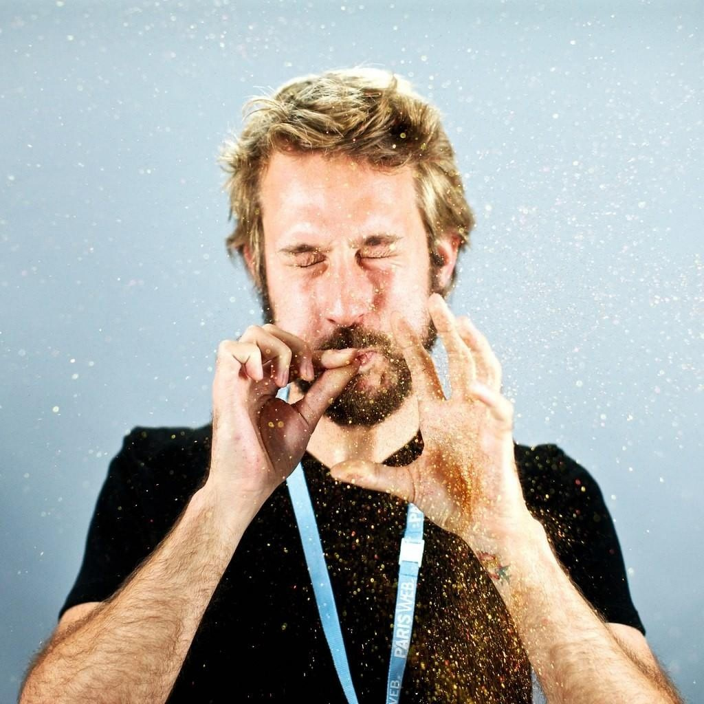

# Public Talks

Public talks provided either in English or French, about JavaScript or human-centric topics.

## Performed Talks

Since March 2013, all slides are baked in HTML using the nice [reveal.js](https://github.com/hakimel/reveal.js/).

Prior to March 2013, slides are [available on my Slideshare account](http://www.slideshare.net/oncletom/presentations).

## Available Topics

You can find eventual talks in the [`proposals/`](proposals) folder. For sure I can speak about other things or mix topics to fit your audience requirements.

# Biography and Contact

## Biography

**Thomas Parisot is a Senior Web Engineer at BBC R&D** in London, United Kingdom. His work there involves compelling user experience prototypes, audio visualisation and Open Source collaboration thanks to JavaScript and Web technologies.

He is a believer of cross-disciplines learning, simple things and chance. Of course he likes cheese. Of course he likes wine. And [words](https://oncletom.io). And [making pictures](https://oncletom.io/photos/).

Aside that, he co-created the [Sud Web conference](http://sudweb.fr) in France, has an upcoming Node.js book to be published in French and has no problem to admit he co-founded a startup which failed.

  
*Photo Credit*: [Mathieu Drouet / Take a Sip](http://www.takeasip.net/) (he can do cool stuff for you)

## Contact

*Location*: London, United Kingdom

* **Twitter**: [@oncletom](https://twitter.com/oncletom)
* **Github**: [@oncletom](https://github.com/oncletom)
* **Email**: [thomas@oncle-tom.net](mailto:thomas@oncle-tom.net)
* **Website**: [oncletom.io](https://oncletom.io)
